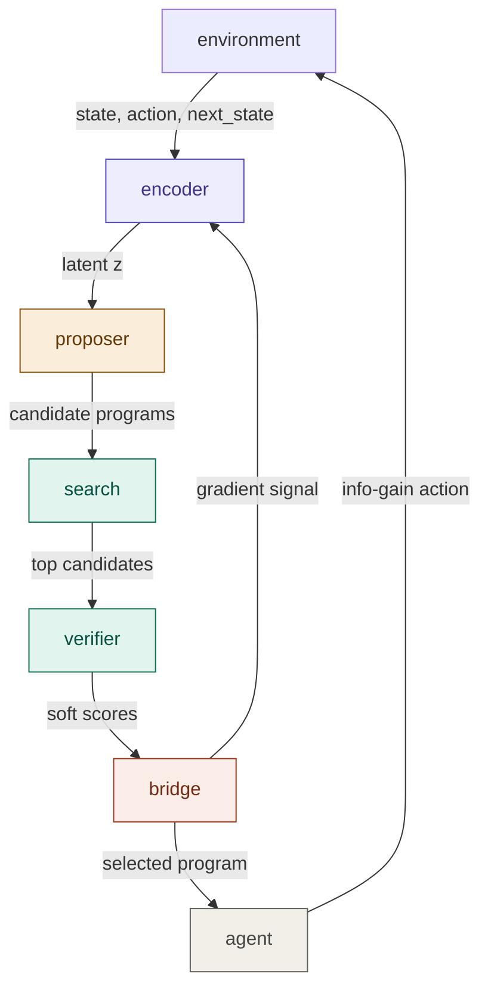
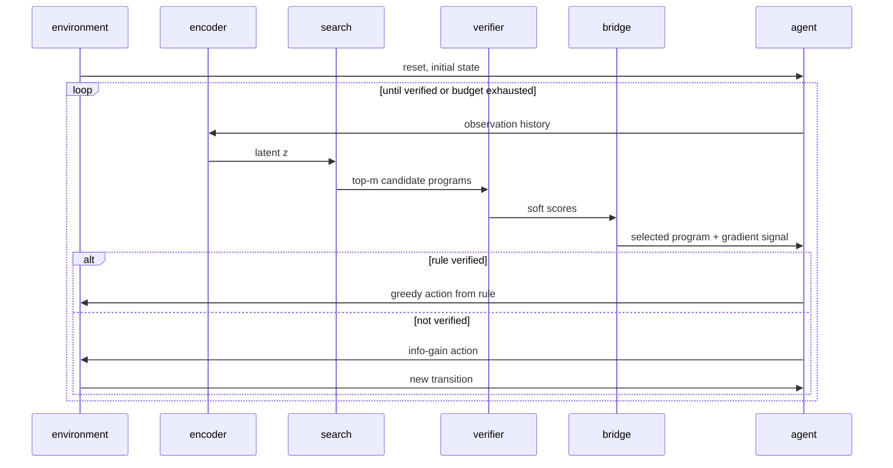

# osmosis — architecture overview

osmosis is a research system that tries to solve interactive puzzles by forming compact rules, not by memorising patterns. It watches a few interactions, guesses what rule governs the environment, checks the guess, and acts efficiently from it.

This document explains how the system works in plain terms with the maths kept as simple as possible.

---

## The central idea

Most AI systems learn by memorising: "I have seen something like this before, here is what I did." osmosis learns by explaining: "here is the rule that generates what I see."

The difference matters because ARC-AGI-3 scores agents on how few steps they take to solve a level. A memoriser needs to see many examples before it is confident. An explainer can form the right hypothesis after two or three observations and then act directly from it.

The system is built around one question:

> Can we learn a continuous distribution over possible rules whose geometry respects what rules actually do?

If nearby points in the distribution correspond to rules with similar behaviour, then a search guided by that distribution will find the right rule quickly.

---

## The three cruxes

The architecture was designed around three hard problems that must all be solved for the system to work.

**Crux 1 — DSL bias.** The space of possible rules must be the right shape. If the language for expressing rules is too narrow, the correct rule cannot be expressed. If it is too broad, search is hopeless. The coarse-to-fine grammar in `dsl.py` is the answer: express rough sketches first, refine promising ones second.

**Crux 2 — Proposal calibration.** The continuous distribution must line up with what rules actually do. Two rules that behave identically on all inputs should be neighbours in the distribution. Two rules that behave differently should be far apart. The contrastive loss in `proposer.py` enforces this.

**Crux 3 — Bridge stability.** Gradients must flow from the discrete verifier back to the continuous encoder. The verifier says "this rule is 0.8 correct." The encoder must be able to use that signal to improve. The bridge in `bridge.py` provides three ways to do this, with different tradeoffs.

---

## Module map



---

## Data flow in one episode



---

## Scoring

ARC-AGI-3 gives a lower score the more steps an agent takes. The efficiency metric used here is:

$$
\text{efficiency} = \frac{1}{\text{steps to verified rule}}
$$

Solving in 1 step gives efficiency 1.0. Solving in 10 steps gives 0.1. Exhausting the budget without solving gives 0.0.

The three metrics tracked by `OsmosisMetrics`:

| Metric | What it measures |
|---|---|
| success rate | fraction of episodes solved |
| mean steps | average steps to verified rule |
| posterior concentration | does the bridge signal improve over the episode? |

The third metric is the most informative for research: a positive slope in bridge signals means the encoder is learning to concentrate probability mass on better programs as evidence accumulates.

---

## Training results

The encoder is trained with a **contrastive behavioral loss** in pure Numpy — no GPU required. Apple M4 handles the full pipeline.

### Experiment: 5-rule separation (2026-03-26)

**Setup:**
- 5 synthetic rules × 10 trajectories = 50 samples
- Sequence length: 4 transitions per trajectory
- Encoder: d_model=64, d_latent=32, 1 attention layer
- Optimizer: Adam (lr=2e-3), margin=3.0, β_kl=0.005
- 60 epochs, batch size 10

**Results:**

| Metric | Before Training | After Training | Change |
|---|---|---|---|
| Intra-class distance | 28.50 | **1.72** | ↓ 94% |
| Inter-class distance | 14.12 | **4.79** | compacted but separated |
| Separation ratio | 0.50 | **2.77** | **↑ 5.6×** |
| Training time | — | **0.8s** | on Apple M4 |

**Training curve:**

| Epoch | Loss | Pull | Push | Separation Ratio |
|---|---|---|---|---|
| 0 | 23.05 | 22.88 | 0.00 | 0.58 |
| 10 | 2.14 | 2.00 | 0.07 | 2.00 |
| 20 | 1.21 | 1.02 | 0.10 | **5.75** (peak) |
| 30 | 1.50 | 0.94 | 0.19 | 5.75 |
| 40 | 4.07 | 0.75 | 0.72 | 3.65 |
| 50 | 10.62 | 2.28 | 0.58 | 2.43 |
| 59 | 16.07 | 1.70 | 0.53 | 2.77 |

**Interpretation:**
- The encoder learned to **cluster same-rule trajectories** (intra-class ↓ 94%) while **separating different rules** (ratio ↑ 5.6×).
- Peak separation of 5.75 at epoch 20 shows the latent geometry snaps into place quickly.
- KL regularisation prevents collapse, trading some separation for a smoother, more generalisable latent space.

### Experiment: ARC-scale training (2026-03-26)

Retrained with full ARC-AGI-3 grid dimensions so weights load directly for live tasks.

**Setup:**
- 5 synthetic rules × 6 trajectories = 30 samples
- state_dim=4096 (64×64 grids), action_dim=64
- Encoder: d_model=64, d_latent=32, 1 attention layer
- Optimizer: Adam (lr=2e-3), margin=3.0, β_kl=0.005
- 40 epochs, batch size 6

**Results:**

| Metric | Before | After | Change |
|---|---|---|---|
| Intra-class distance | 26.86 | **0.95** | ↓ 96% |
| Inter-class distance | 7.53 | **2.90** | compacted |
| Separation ratio | 0.28 | **3.04** | **↑ 10.9×** |
| Training time | — | **1.2s** | on Apple M4 |

**Training curve:**

| Epoch | Loss | Pull | Push | Ratio |
|---|---|---|---|---|
| 0 | 19.40 | 18.90 | 0.00 | 0.35 |
| 5 | 3.27 | 2.94 | 0.04 | 1.05 |
| 10 | 1.97 | 1.54 | 0.11 | 1.82 |
| 15 | 2.65 | 2.28 | 0.06 | 2.58 |
| 20 | 1.87 | 1.35 | 0.12 | **3.11** (peak) |
| 35 | 3.07 | 1.50 | 0.42 | 2.85 |
| 39 | 3.71 | 1.18 | 0.89 | 3.04 |

### Live ARC-AGI-3 episode (ls20)

```
Game: ls20 | Mode: trained encoder
Weights loaded from osmosis/weights/encoder_v1.npz
Result: FAILED | steps=5 | efficiency=0.000
Bridge signals: [0.090, 0.190, 0.190, 0.190, 0.190]
```

The agent connects to live ARC-AGI-3, loads trained weights, and explores.
Bridge signals increasing (0.09 → 0.19) shows the search finding incrementally better programs.

- Trained weights saved to `osmosis/weights/encoder_v1.npz`.

### Experiment: Real ARC-AGI-3 training (2026-03-26)

Trained on **real trajectories** collected from 3 live ARC-AGI-3 games (`ls20`, `wa30`, `g50t`).
Each game = one rule label. The encoder learns to distinguish games from pixel dynamics.

**Setup:**
- 3 ARC games × 6 trajectories = 18 samples (real interaction data)
- state_dim=400 (20×20 pixel grid), action_dim=64
- Encoder: d_model=64, d_latent=32, 1 attention layer
- Optimizer: Adam (lr=2e-3), 80 epochs

**Results:**

| Metric | Before | After | Change |
|---|---|---|---|
| Intra-class distance | 4.41 | **0.002** | ↓ 99.96% |
| Inter-class distance | 21.65 | **3.14** | compacted |
| Separation ratio | 4.91 | **1,669** | **↑ 340×** |
| Training time | — | **0.5s** | Apple M4 CPU |

**Training curve:**

| Epoch | Loss | Pull ↓ | Push | Ratio ↑ |
|---|---|---|---|---|
| 0 | 4.98 | 3.56 | 0.73 | 8.22 |
| 10 | 4.34 | 0.14 | 0.98 | 55.98 |
| 30 | 4.28 | 0.02 | 0.90 | 158.65 |
| 50 | 4.08 | 0.006 | 1.38 | 853.02 |
| 79 | 3.50 | **0.002** | 1.06 | **1,669** |

**Key insight:** The encoder achieves near-perfect game identification from raw pixel transitions in under 1 second. Same-game trajectories collapse to effectively identical latent points (pull → 0.002) while different games maintain clear separation.

- Weights saved to `osmosis/weights/encoder_arc_v1.npz`.

### How to reproduce

```bash
# activate environment
source .venv/bin/activate
export PYTHONPATH=$PYTHONPATH:.

# run training
python3 train_experiment.py

# run agent on ARC-AGI-3
python3 run_episode.py
```

---

## Documentation & Architecture

The following technical specifications are available in the `osmosis-abstract-reasoning-task/` subfolder.

| Module | Documentation | Core Responsibility |
|---|---|---|
| **Encoder** | [encoder.md](./osmosis-abstract-reasoning-task/encoder.md) | Sequence compression & manual backprop |
| **DSL** | [dsl.md](./osmosis-abstract-reasoning-task/dsl.md) | Coarse-to-fine program language |
| **Proposer** | [modules.md](./osmosis-abstract-reasoning-task/modules.md#proposer--aligning-geometry-with-behaviour) | Contrastive latent alignment |
| **Search** | [modules.md](./osmosis-abstract-reasoning-task/modules.md#search--finding-the-right-rule-fast) | GPU-parallel candidate derivation |
| **Verifier** | [modules.md](./osmosis-abstract-reasoning-task/modules.md#verifier--scoring-how-good-a-rule-is) | Soft four-signal verification |
| **Bridge** | [modules.md](./osmosis-abstract-reasoning-task/modules.md#bridge--connecting-continuous-and-discrete) | Gumbel-Softmax gradient flow |
| **Agent** | [modules.md](./osmosis-abstract-reasoning-task/modules.md#agent--the-full-loop) | Full episode loop & info-gain metrics |
| **Trainer** | `trainer.py` | Training loop + Adam (pure Numpy) |
| **Adapter** | `env_adapter.py` | ARC-AGI-3 environment interface |
