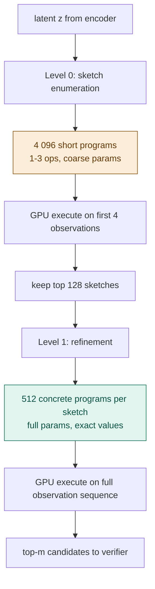

# dsl — the language of rules

## What it does in plain terms

The DSL (domain-specific language) defines what a "rule" is. It is a small vocabulary of grid operations that can be combined into programs. The verifier uses these programs to predict what the environment will do next.

The key design decision is the coarse-to-fine structure. Instead of searching over all possible programs from the start, osmosis first searches over short sketches, then refines only the promising ones into full programs.

---

## Why language design is Crux 1

If the DSL does not contain the right primitives, the correct rule cannot be expressed. No amount of clever inference will fix a vocabulary that is missing the necessary words.

At the same time, a DSL that is too expressive makes search impossibly slow. The goal is the smallest vocabulary that can express all the rules appearing in the target environments.

The primitives were chosen by examining the ARC-AGI-3 game data. Games with keyboard input tend to involve spatial transforms (translate, rotate, flip). Games with click input tend to involve color operations (recolor, select). The vocabulary covers both.

---

## Two grammar levels

**Level 0 sketches** are short sequences of high-level operations with coarse parameter bins. For example: "translate by roughly one step, then recolor." There are about 4 096 of these. They are cheap to execute and easy to enumerate.

**Level 1 programs** are fully instantiated: exact offsets, exact colors, exact region boundaries. Each sketch expands into 512 concrete programs by randomly sampling fine-grained parameters. The total search space is 4 096 x 512 = 2 million programs, but the coarse pruning means only 128 x 512 = 65 536 are fully evaluated.

---

## Primitive operations

| Category | Operations |
|---|---|
| Spatial | translate, rotate 90, flip horizontal, flip vertical, crop |
| Color | recolor, fill background, invert colors, threshold |
| Pattern | tile, mirror extend, gravity |
| Selection | select color, select region |
| Compositional | compose (A then B), conditional (if color present: A, else B) |

The compositional operations are important for hard levels. A rule like "if color 3 is present, pull everything downward; otherwise flip horizontally" requires CONDITIONAL wrapping two sub-programs.

---

## The interpreter

The interpreter is a pure function:

$$
\text{execute}(\text{program},\ s,\ a) \rightarrow s'
$$

It takes a program, an input state, and an action, and returns a predicted next state. It has no side effects and no memory.

This property is what makes GPU batch execution possible. The interpreter can be run on k programs simultaneously because each execution is independent of the others.

---

## State and action representation

A state is a grid of integers from 0 to 9, where each integer is an ARC color. The background is always 0.

An action is encoded as a fixed-length float vector so it can be passed through the encoder's triple embedder. Keyboard keys are hashed to one-hot positions. Click coordinates are mapped to separate positions.

---

## Coarse-to-fine reasoning

The two-level structure solves a real combinatorial problem. Consider enumerating all programs of length 3 with exact parameters. With 17 op codes and even modest parameter ranges, the space exceeds 10 billion programs. That is not searchable.

By separating "what type of operation" (Level 0) from "what exact parameters" (Level 1), osmosis reduces the Level 0 search to 4 096 candidates, which can be evaluated in milliseconds even on CPU. Only 128 of those advance to full evaluation.

$$
\text{effective search space} = \underbrace{4096}_{\text{sketches}} \times \underbrace{0.03}_{\text{keep top 3\%}} \times \underbrace{512}_{\text{refinements}} = 65\,536
$$

This is the number the GPU executor actually processes: tractable, and fast in parallel.
