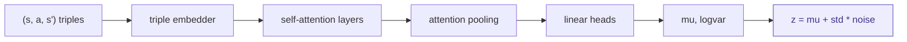

# encoder — compressing observations into a hypothesis

## What it does in plain terms

The encoder watches a sequence of interactions — "I was in state S, I took action A, the world became S'" — and produces a single compact vector called the latent z.

Think of z as a compressed belief about what rule governs the environment. After seeing one interaction, z is vague. After seeing five, it should be more specific. After seeing enough, it should point strongly at the correct rule.

---

## Why transitions, not states

Most encoders compress states: "what does this grid look like?" osmosis compresses transitions: "what happened when I intervened."

This distinction matters. Two grids can look similar but be governed by completely different rules. Two transition sequences governed by the same rule will produce a consistent pattern regardless of what the grids look like.

By encoding (state, action, next_state) triples, the encoder learns causal structure rather than visual structure.

---

## Architecture

**Triple embedder.** Concatenates [s, a, s'] into a single vector and passes it through a two-layer network to produce a token of size d_model. One token per interaction.

**Self-attention.** Lets each token look at every other token. A transition that contradicts the pattern can suppress misleading earlier transitions. A transition that reveals the rule can amplify consistent ones.

**Attention pooling.** Not all transitions are equally informative. Some steps are noise. Some steps reveal the rule. The pooling layer learns a query vector that assigns higher weight to more informative transitions.

$$
\text{weight}_i = \text{softmax}(q \cdot \text{token}_i)
$$

$$
\text{pooled} = \sum_i \text{weight}_i \cdot \text{token}_i
$$

**Linear heads.** Two separate linear projections produce mu (the centre of the latent distribution) and logvar (the log of its variance).

**Reparameterisation.** A sample z is drawn from the distribution without breaking gradient flow:

$$
z = \mu + e^{0.5 \cdot \text{logvar}} \cdot \varepsilon \quad \text{where} \quad \varepsilon \sim \mathcal{N}(0, I)
$$

---

## The ELBO loss

The encoder is trained with the Evidence Lower BOund (ELBO):

$$
\text{ELBO} = \underbrace{\text{reconstruction loss}}_{\text{does z lead to the right rule?}} + \beta \cdot \underbrace{D_{\text{KL}}(q(z|x) \,\|\, p(z))}_{\text{keep z close to the prior}}
$$

The reconstruction loss comes from the verifier: how well does the program found by searching near z explain the observed transitions?

The KL term keeps the latent space well-organised. Without it, the encoder can place different rules in completely separate parts of the space with no useful structure between them.

The beta parameter is annealed from 0 to 1 during training (beta-VAE schedule). Starting with beta=0 lets the encoder first learn to reconstruct correctly before being forced to organise the latent space.

---

## Empty sequence handling

At the first step of an episode, the observation sequence is empty. The encoder returns the prior: z sampled from N(0, I). This is intentional — before any observations, all rules are equally plausible.

---

## Behavioral alignment loss

The encoder also receives a contrastive signal from the proposer module. If two observation sequences are governed by the same underlying rule, their latents should be close. If governed by different rules, they should be far apart.

This is what shapes the latent space into a meaningful geometry over rules, rather than just a smooth but arbitrary compression.

$$
\text{loss}_{\text{contrastive}} = \begin{cases} \|z_i - z_j\|^2 & \text{if same rule} \\ \max(0,\ m - \|z_i - z_j\|)^2 & \text{if different rule} \end{cases}
$$

where m is a margin (default 2.0) that defines the minimum separation between different rules.
