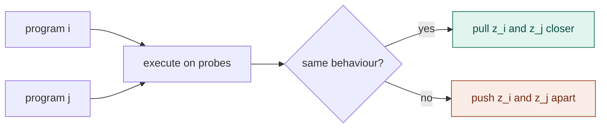
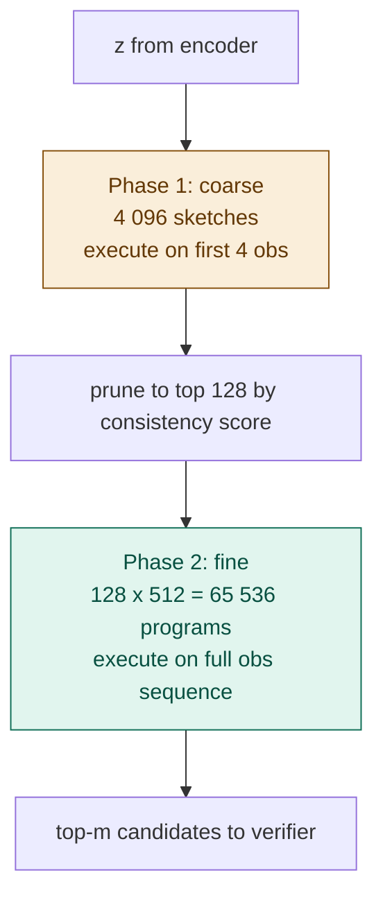
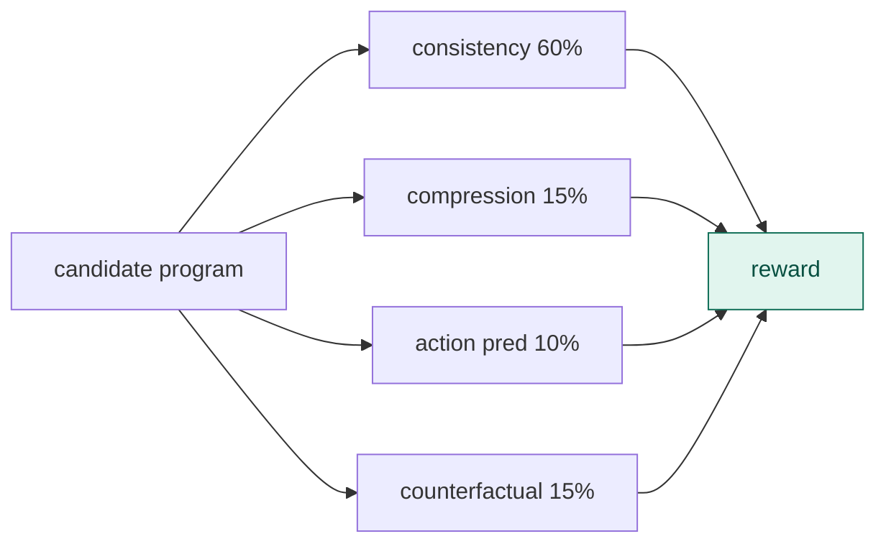
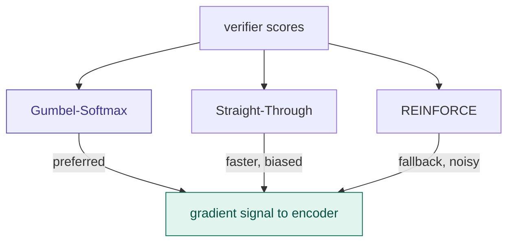
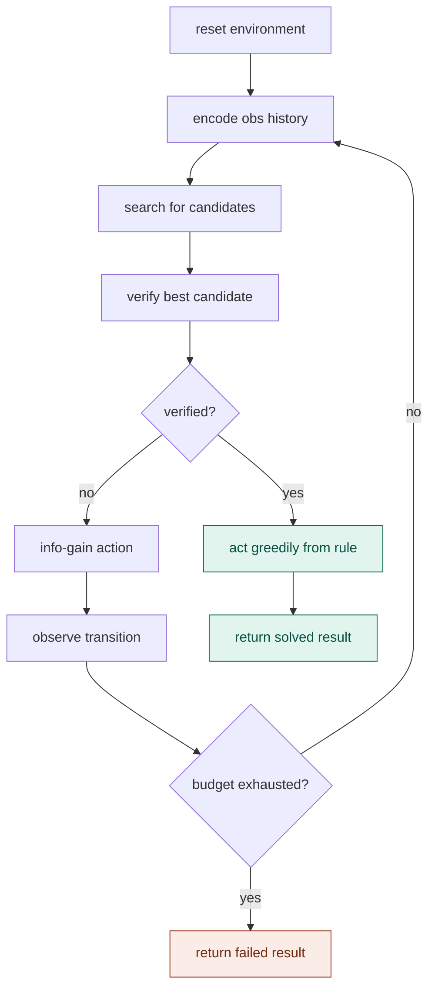

# proposer — aligning geometry with behaviour

## What it does in plain terms

The proposer enforces a crucial property: rules that behave the same way should be neighbours in the latent space. Rules that behave differently should be far apart.

Without this, the encoder might produce a beautifully smooth latent space that is completely useless for search — nearby points could correspond to rules with totally different behaviours.

---

## The alignment problem

The encoder compresses observations into a latent z. The search uses z to find candidate programs. But there is a hidden assumption: that points near z in latent space correspond to programs with similar behaviour.

This assumption is not automatically satisfied. A neural network will produce smooth embeddings, but "smooth" does not mean "semantically aligned."

The proposer fixes this by adding a contrastive loss during training.

---

## How contrastive learning works



The key object is the **probe set**: a fixed collection of (state, action) pairs used to test what a program does. Two programs are behaviourally equivalent if they produce identical outputs on all probes.

The contrastive loss has two cases:

**Positive pair** (same behaviour):
$$
\mathcal{L} = \|z_i - z_j\|^2
$$
Minimising this pulls equivalent programs together in latent space.

**Negative pair** (different behaviour):
$$
\mathcal{L} = \max(0,\ m - \|z_i - z_j\|)^2
$$
Minimising this pushes non-equivalent programs apart, but only until they are separated by the margin m. Once they are far enough away, the loss is zero.

The margin m (default 2.0) prevents the encoder from collapsing everything into a single point just to minimise the positive loss.

---

## Why probes, not observed transitions

Probes are synthetic test inputs, not part of the agent's history. They are fixed during training.

Using observed transitions would create circular reasoning: the encoder would learn that programs consistent with what it has already seen are similar, which is just restating the search problem.

Probes test generalisation: "do these two programs agree on inputs they have never seen?" This is closer to the real notion of rule equivalence.

---

## Prototype embeddings

The proposer builds an index of prototype embeddings — one per behavioural equivalence class. Programs with identical behaviour share a prototype direction in latent space, with small noise added for distinctness.

When the encoder produces a z, the proposer ranks candidate programs by cosine similarity between z and their prototype:

$$
\text{score}(p) = \frac{z \cdot \text{proto}(p)}{\|z\| \cdot \|\text{proto}(p)\|}
$$

High similarity means z is pointing in the direction of that program's equivalence class.

---
---

# search — finding the right rule fast

## What it does in plain terms

The search module takes the latent z from the encoder and finds the best candidate programs. It does this in two phases to balance speed against coverage.

The key systems contribution of osmosis is the GPU-parallel execution in Phase 2. The CPU reference in `search.py` runs programs sequentially. The GPU version runs all 65 536 programs simultaneously in a single kernel call.

---

## Two-phase search



**Phase 1** executes 4 096 sketches against only the first 4 observations. This is fast because fewer observations means fewer interpreter calls, and sketches are short programs. The consistency score at this stage is noisy but good enough for pruning.

**Phase 2** executes 65 536 refined programs against the full observation sequence. This is the expensive step and the target for GPU acceleration.

---

## Consistency score

The fast inner-loop signal is consistency: the fraction of observed transitions that a program correctly predicts.

$$
\text{consistency}(p) = \frac{\text{correct predictions}}{|\text{obs\_seq}|}
$$

where a prediction is correct if:

$$
\text{execute}(p,\ s,\ a) = s'
$$

A program with consistency 1.0 explains every observed transition perfectly. This is the necessary condition for full verification. Consistency alone is not sufficient — the verifier adds three more signals on top of it.

---

## GPU acceleration (target)

The CPU reference loops over programs sequentially. The GPU version vectorises the interpreter across the k-batch dimension.

Concretely, instead of:

```
for program in programs:
    score = execute(program, obs_seq)
```

the GPU version runs:

```
scores = cuda_exec(programs_tensor, obs_tensor)
```

where `cuda_exec` is a custom CUDA kernel that maps each thread to one program-transition pair. This makes the execution time independent of k (the number of programs), up to hardware limits.

The CPU reference achieves roughly 28 000 programs/second on a 5x5 grid. A GPU implementation should reach 10-100 million programs/second, which is the 100-1000x speedup the architecture relies on.

---
---

# verifier — scoring how good a rule is

## What it does in plain terms

The verifier takes a candidate program and scores it on four dimensions. It returns a soft reward in [0, 1] rather than a hard pass/fail.

This softness is essential for training. Hard pass/fail means most training steps produce zero gradient because most programs are wrong. Soft scoring means the encoder always gets a signal, even when no program is fully correct yet.

---

## Four signals



**Consistency (60% weight).** Fraction of observed transitions correctly predicted. This is the primary signal. A program must score 1.0 here to be marked as verified.

$$
\text{consistency} = \frac{\text{correct predictions}}{|\text{obs\_seq}|}
$$

**Compression (15% weight).** Shorter programs are preferred. ARC tasks are designed to have compact solutions. A program of length 1 scores 1.0; each additional operation reduces the score.

$$
\text{compression} = \frac{1}{\text{program length}}
$$

**Action prediction (10% weight).** A program that always returns the input state unchanged is degenerate — it has learned nothing. This signal rewards programs that produce meaningful changes.

$$
\text{action\_pred} = \frac{\text{transitions where output} \neq \text{input}}{|\text{obs\_seq}|}
$$

**Counterfactual (15% weight).** Does the program behave consistently on held-out probe states? Consistent behaviour suggests a genuine rule rather than overfitting to the observed transitions.

---

## Full verification condition

A program is fully verified only when:

1. consistency == 1.0 (explains every observed transition)
2. obs_seq is non-empty (at least one observation has been made)

The reward is soft regardless. Only the `verified` flag is hard. The agent acts greedily from a rule as soon as `verified` becomes True.

---

## Weighted reward

$$
\text{reward} = 0.60 \cdot \text{consistency} + 0.15 \cdot \text{compression} + 0.10 \cdot \text{action\_pred} + 0.15 \cdot \text{counterfactual}
$$

The weights can be adjusted. The 60% weight on consistency reflects that it is the necessary condition. The other three signals guide the encoder before any program reaches consistency 1.0.

---
---

# bridge — connecting continuous and discrete

## What it does in plain terms

The bridge solves a fundamental problem: the encoder produces a continuous latent z, but the verifier scores discrete programs. There is no obvious way to send gradients from "program 47 scored 0.8" back to "adjust z in this direction."

The bridge provides three ways to construct a differentiable path between them.

---

## Why this is hard

Consider a simple case. The encoder produces z. The search finds 10 candidate programs. The verifier scores them. You want to update z to produce better candidates next time.

But "update z" requires a gradient. And the gradient must flow through "pick a program from a list," which is a discrete, non-differentiable operation.

This is the same fundamental problem that appears in reinforcement learning, variational autoencoders with discrete latents, and neural program synthesis. osmosis inherits all three solution strategies.

---

## Three approaches



**Gumbel-Softmax (preferred).** Adds noise to scores and applies a soft temperature-scaled selection. As temperature decreases, selection approaches hard argmax. As temperature increases, selection approaches uniform random.

The Gumbel noise comes from sampling U from Uniform(0,1) and computing:

$$
g = -\log(-\log(U))
$$

The soft weights are:

$$
w_i = \frac{\exp((s_i + g_i) / \tau)}{\sum_j \exp((s_j + g_j) / \tau)}
$$

where s are the scores, g are Gumbel noise samples, and tau is the temperature.

Temperature is annealed linearly from 1.0 to 0.1 over training, shifting from exploration to exploitation.

**Straight-Through Estimator (faster).** The forward pass uses hard argmax (fully discrete). The backward pass pretends argmax was the identity function. This is mathematically incorrect but works in practice.

**REINFORCE (fallback).** Treats program selection as a policy decision. Samples programs proportional to scores, uses the verifier reward as a signal, subtracts a baseline to reduce variance. No differentiability needed.

---

## Temperature annealing

$$
\tau(\text{step}) = \tau_{\text{start}} + \frac{\text{step}}{\text{anneal\_steps}} \cdot (\tau_{\text{end}} - \tau_{\text{start}})
$$

At step 0: tau = 1.0 (broad exploration)
At step 10 000: tau = 0.1 (sharp exploitation)

The gradient signal in the early training phase points in many directions simultaneously, which helps the encoder learn a diverse latent space. Late in training, the sharp temperature commits to the best programs.

---
---

# agent — the full loop

## What it does in plain terms

The agent runs the complete episode. It coordinates encoder, search, verifier, and bridge into a loop that either finds a verified rule or exhausts its budget.

The key design decision is info-gain exploration: when no rule is verified yet, the agent does not act randomly. It chooses the action that would most update its beliefs about which rule is correct.

---

## Episode loop



---

## Info-gain action selection

When the verifier has not found a verified rule, the agent must explore. But random exploration is wasteful — it may reveal nothing useful about which rule is correct.

Info-gain exploration asks: "which action would most reduce my uncertainty about the rule?"

For each available action a, the agent simulates what each candidate program would predict as the outcome. Actions where the candidates disagree are more informative than actions where they all agree.

$$
\text{info\_gain}(a) \approx \text{fraction of cell positions where candidates disagree on outcome}
$$

The action with the highest info-gain is taken. After observing the real outcome, the candidates that predicted incorrectly can be eliminated.

This is active learning applied to rule induction: the agent designs its own experiments.

---

## Greedy acting from a verified rule

Once a rule is verified, exploration stops. The agent acts by choosing the action that the rule predicts will produce the most change.

This is a heuristic: ARC tasks typically require the agent to do something to the grid, so the action that causes the most transformation is usually correct. A more principled version would have the goal state encoded in the environment.

---

## The three metrics

The review identified three metrics as most informative:

**Success rate.** Did the agent solve the episode? This is the headline number but not the most useful for research.

**Mean exploration steps.** How many steps before the rule was verified? This directly maps to the ARC-AGI-3 efficiency score. The target is to stay well below the baseline action counts in the game data.

**Posterior concentration rate.** Does the bridge signal improve over the course of an episode? A positive slope means the encoder is learning to concentrate probability mass on better programs as evidence accumulates. This is the scientific signal that distinguishes "the system got lucky" from "the system is actually learning to reason."

$$
\text{posterior concentration} = \text{mean slope of bridge signal across episode steps}
$$

A system that truly forms hypotheses should show increasing bridge signals as evidence narrows the posterior. A system that is just pattern-matching should show flat or noisy signals.
